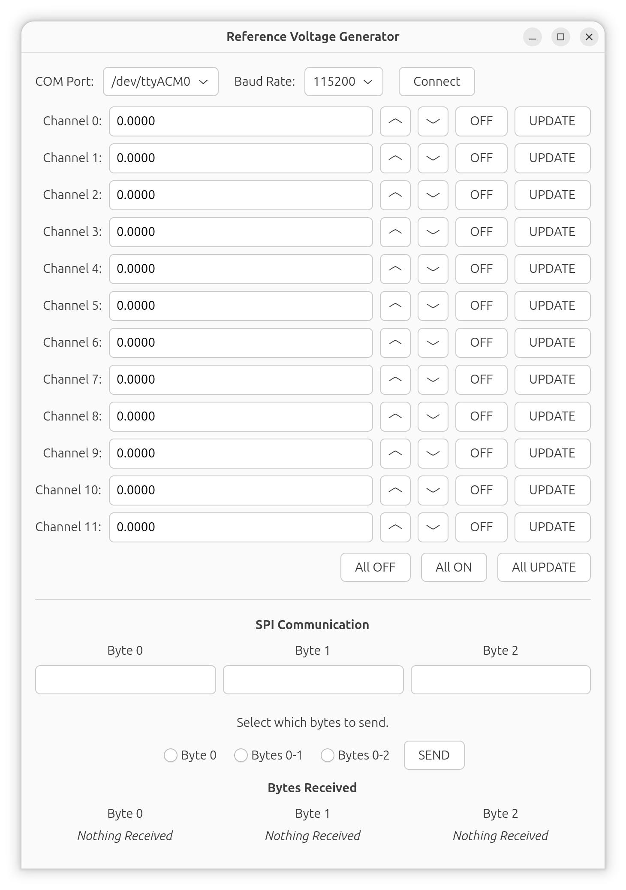
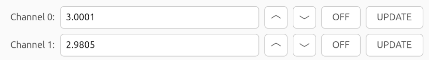
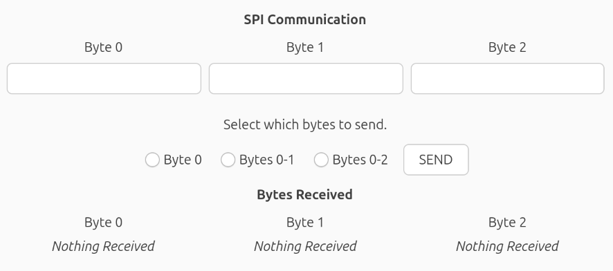

# Reference Voltage Generator
- [Initiating Serial Communication](#initiating-serial-communication)
- [Entering Voltage Values](#entering-voltage-values)
- [SPI Communication](#spi-communication)
- [How to Run the GUI on Windows](#how-to-run-the-gui-on-windows)
- [How to Compile Natively on Linux](#how-to-compile-natively-on-linux)
- [How to Cross-Compile on Linux](#how-to-cross-compile-on-linux)
- [How to Upload Sketch to Adafruit Feather](#how-to-upload-sketch-to-adafruit-feather)
- [How to Upload Sketch to Arduino Nano](#how-to-upload-sketch-to-arduino-nano)

Reference Voltage Generator is a set of programs in which a user can enter voltage values to a graphical user interface (GUI) and a microcontroller responds to GUI events by sending those voltage values to digital-to-analog converters (DACs). The GUI application in Figure 1 was developed on Linux in C using GTK4. It can be cross-compiled to Windows using Linux as the host machine. The precompiled Windows executable is also available. The GUI was designed to communicate with an Adafruit Feather ESP32-S3 Reverse TFT. The Feather application parses commands received from the GUI and determines if the command intends to send a voltage value to one of the DACs via I2C, or if the command is meant to send bytes to another microcontroller via SPI.


*Figure 1. Graphical user interface.*

## Initiating Serial Communication
[Jump to Top](#reference-voltage-generator)


*Figure 2. Dropdown menus for COM port, baud rate, and initiating connection.*

The user begins by selecting a serial communication port from the COM Port dropdown menu in Figure 2. The listed ports are COM1–8, USB0–1, and ACM0. Users on Windows operating systems should select from COM1–8. Users on other operating systems should select from USB0–1 or ACM0. Command-line utilities such as lsusb on Linux may help the user figure out which serial communication ports are available on their computer and which particular port their target device (e.g. a microcontroller) is connected to.

The user can also select a baud rate from the next dropdown menu. Available baud rates are 1200, 2400, 4800, 9600,19200, 38400, 57600, 115200, 230400, 460800, and 921600. The user should select the appropriate baud rate for their target device by reading their device’s datasheet.

After the user selects a COM Port and Baud Rate and clicks the Connect button, the application will attempt to connect to the target device with the selected settings. The user should troubleshoot by verifying that their COM Port and Baud Rate selections are correct, disconnecting and reconnecting their device to the port, and checking if their cable is “charge-only.” A cable designed only for charging battery is not the same as a cable meant for data transfer, which is the type of cable required for serial communication.

## Entering Voltage Values
[Jump to Top](#reference-voltage-generator)

The user can enter values for twelve channels, numbered Channels 0–11. Figure 3 shows Channels 0–1. The user can enter voltage values within the range of 0.0000 to 5.0000 volts. If the user tries to enter an out-of-bounds value, it will automatically be clamped within range. A value of –1 will be forced to 0 and a value of 5.9999 will be forced to 5.0000. The value can be increased or decreased by 100 microvolts at a time by clicking the Arrow-Up and Arrow-Down buttons next to the corresponding voltage entry.


*Figure 3. Channels 0-1.*

Figure 3 also shows ON/OFF and UPDATE buttons. The ON/OFF button is a two-state toggle that begins in state OFF. When the OFF state is toggled, the application sends a command to power off the corresponding DAC (e.g. Toggling Channel 0 OFF will power off DAC 0). When UPDATE is clicked, the application sends a command to the Feather containing the DAC number and voltage value, and the Feather applies the voltage value to the right DAC. When the ON state is toggled, the application sends a command to power on the same DAC with the last voltage value that was written to it.


*Figure 4. All OFF/ON/UPDATE buttons below Channel 11.*

In Figure 4, below Channel 11, there are three buttons, All OFF, All ON, and All UPDATE. The first toggles the OFF state for each ON/OFF button and the second toggles the ON state. The application sends one command at a time to power off each DAC, starting from DAC 0.

## SPI Communication
[Jump to Top](#reference-voltage-generator)

In Figure 5, the user can enter three bytes of data in hexadecimal format. They can choose to send the first byte, the first and second byte, or all three bytes. The application was tested to send user-inputted bytes through the Feather to an Arduino Nano via SPI. It was also tested to receive bytes from the Nano, through the Feather, and display the received bytes on the application window. The text will read “Nothing received” until bytes arrive at the Feather’s serial port from the Nano.


*Figure 5. SPI section of the GUI where the user can send bytes and view received bytes.*

### How to Run the GUI on Windows
[Jump to Top](#reference-voltage-generator)

Clone the repository and enter the `windows_app` directory. This directory contains DLLs (Dynamic-Link Libraries) that the Windows executable requires. 
```
git clone https://github.com/scguerrero/ReferenceVoltageGenerator.git
cd ReferenceVoltageGenerator/windows_app
```
Open this directory in your file manager and double-click the executable ReferenceVoltageGenerator.exe.

### How to Compile Natively on Linux
[Jump to Top](#reference-voltage-generator)

Clone the repository, open it, compile `main.c`, and run it with `./main`.
```
git clone https://github.com/scguerrero/ReferenceVoltageGenerator.git
cd ReferenceVoltageGenerator
gcc $(pkg-config --cflags gtk4) -o main main.c $(pkg-config --libs gtk4) -lm
./main
```

### How to Cross-Compile on Linux
[Jump to Top](#reference-voltage-generator)

Install [quasi-msys2](https://github.com/HolyBlackCat/quasi-msys2) according to the instructions for your Linux distribution in the [Usage](https://github.com/HolyBlackCat/quasi-msys2#usage) section.

When the installation is complete, enter the `quasi-msys2` directory. Open the shell and compile `main.c` inside the environment.

```
env/shell.sh # Open the shell

# Cross-compile the executable named ReferenceVoltageGenerator.exe
x86_64-w64-mingw32-gcc main.c -o ReferenceVoltageGenerator.exe `pkg-config --cflags --libs gtk4` -lm

ls # Check that the exe was created by looking at the list of files
exit # Close the shell
```

Create a new directory, *not* inside `quasi-msys2`, called `windows_app` (any name will work as long as it indicates that it's for Windows). Copy the Windows executable you just created to this new directory. Copy the Windows DLLs (Dynamic-Link Libraries) to this new directory as well.

```
# In a different directory that isn't quasi-msys2
mkdir windows_app

# Copy the exe to the new directory
# IMPORTANT: Adjust path to where your quasi-msys2 directory is located on your computer
cp /path/to/quasi-msys2/ReferenceVoltageGenerator.exe /path/to/windows_app/

# Copy the DLLs to the new directory
cp -r /path/to/quasi-msys2/root/ucrt64/bin/ /path/to/windows_app/
```

To test the Windows executable on Linux, use Wine to run it.

```
cd windows_app

# Set Wine display and language settings to avoid seeing corrupted fonts in the GUI
PANGOCAIRO_BACKEND=fc LANG=en_US.UTF-8 WINEPATH="bin/" wine ReferenceVoltageGenerator.exe
```

If it runs with readable fonts, then it is safe to run natively on Windows. Always run the Windows executable inside the folder with the DLLs. It will fail to execute if it does not have access to them. The author is aware of this issue and will update this section when she solves it.

### How to Upload Sketch to Adafruit Feather
[Jump to Top](#reference-voltage-generator)

The GUI is designed to communicate with an Adafruit Feather ESP32-S3 Reverse TFT. Uploading Arduino sketches to the Feather through Arduino IDE is error-prone on Ubuntu Linux, so this project uses [esptool](https://github.com/espressif/esptool) to upload Arduino sketches to the Feather on the command line. Windows users likely will not encounter this issue and can use Arduino IDE to upload sketches to the Feather as normal. 

Arduino IDE can still be used to write/edit sketches for the Feather. Open the file `esp32_voltage_generator.ino` with Arduino IDE and, if applicable, allow the IDE to automatically place the `.ino` inside a folder. Choose the Feather in the board/port dropdown menu next to the Verify/Upload/Debug circle icons. Click Verify to check for syntax errors. Next, in the top ribbon toolbar, click Sketch > Export Compiled Binary. This will generate binary files that can be flashed to the Feather.

Open the folder containing the `.ino` file. It will contain a new subdirectory called `build/esp32.esp32.adafruit_feather_esp32s3_reversetft`. Open that subdirectory. Use `ls` to check for the following files:
```
esp32_voltage_generator.ino.bootloader.bin
esp32_voltage_generator.ino.partitions.bin
esp32_voltage_generator.ino.bin
```
These will be flashed to the Feather using esptool.

Before flashing, put the Feather in ROM bootloader mode by holding the D0 button, clicking the Reset button on the TFT side (still holding D0), then releasing D0. Check that the Feather is bootloader mode by running `lsusb`. If `lsusb` shows a device with the name `Espressif`, then it is ready for flashing. If the device says `Adafruit`, try again before proceeding.

After confirming that the Feather is in ROM bootloader mode, use esptool to flash the three files listed above to the board.
```
# Try this first
esptool --chip esp32s3 --port /dev/ttyACM0 --baud 921600 write_flash -z \
  0x0 esp32_voltage_generator.ino.bootloader.bin \
  0x8000 esp32_voltage_generator.ino.partitions.bin \
  0x10000 esp32_voltage_generator.ino.bin
  
# If esptool does not work, try this path instead
~/.local/bin/esptool.py --chip esp32s3 --port /dev/ttyACM0 --baud 921600 write_flash -z \
  0x0 esp32_voltage_generator.ino.bootloader.bin \
  0x8000 esp32_voltage_generator.ino.partitions.bin \
  0x10000 esp32_voltage_generator.ino.bin
```
Click the Reset button on the side opposite of the TFT to boot the newly uploaded sketch.

### How to Upload Sketch to Arduino Nano
[Jump to Top](#reference-voltage-generator)

Arduino IDE should work without issue on Linux when uploading to Arduino boards.

Open the file `spi_nano.ino` with Arduino IDE and, if applicable, allow the IDE to automatically place the `.ino` inside a folder. Choose the Arduino Nano in the board/port dropdown menu next to the Verify/Upload/Debug circle icons. Click Verify to check for syntax errors, then click Upload. The Nano will immediately load the new sketch.


